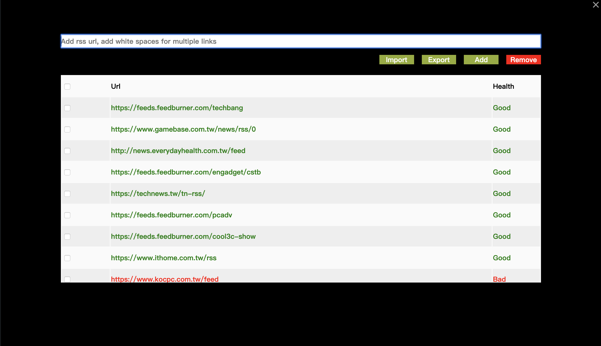

A RSS reader extension made for Chromium-based browsers.

React Native port https://github.com/joeky888/RssNewsMan

Install babel
=====
* npm install --global babel-cli
* npm install

Compile babel code to js
====
* babel jsx/tab_babel.jsx --out-file js/tab.js

Background
=====
* background.html, background.js
* Use jquery as crawl to get feed image
* Update every 200 seconds

Tab
=====
* tab.html, tab.js
* Displayed when a new tab opened
* Use reactjs as viewer and get news from background.js

## TODO

Import/Export OPML format

